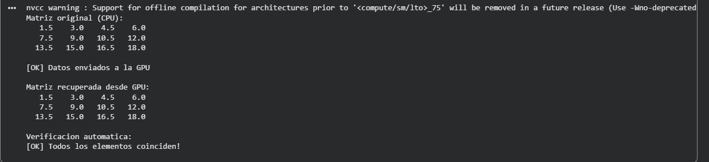
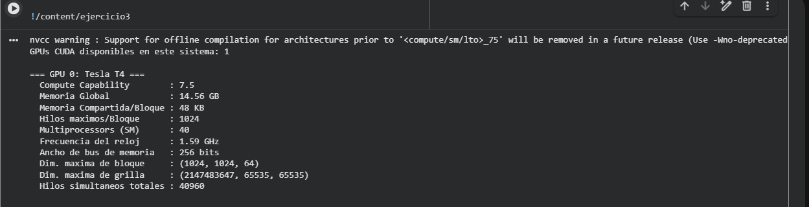
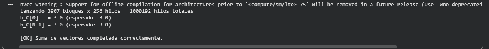
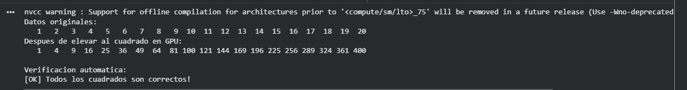
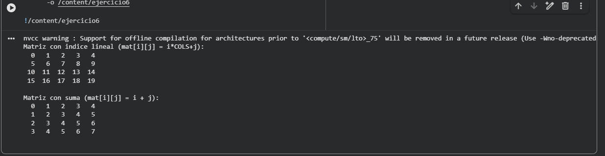

# Taller: Introducción a CUDA — 2026-I

**Universidad de Pamplona | Programación Paralela y Computación Distribuida**  
**Docente:** Prf. Juan Alejandro Carrillo Jaimes  
**Semestre:** 2026-I  
**Integrantes:** Nombre 1 — Nombre 2

---

## Entorno de desarrollo

- Plataforma: Google Colab (GPU NVIDIA T4)
- Compilador: nvcc (CUDA Toolkit)
- Lenguaje: C / CUDA C

---

## Ejercicio 1: Hola GPU — Transferencia CPU ↔ GPU

### ¿Qué hace?
Verifica el flujo básico de transferencia de datos entre CPU y GPU sin ejecutar kernels.
Inicializa 10 enteros en CPU, los copia a GPU con `cudaMemcpy`, los recupera de vuelta
y compara elemento por elemento para verificar integridad.

### Compilar y ejecutar
```bash
nvcc ejercicio1_hola_gpu/ejercicio1_hola_gpu.cu -o ejercicio1
./ejercicio1
```

### Evidencia


### Conclusión
La transferencia CPU↔GPU funciona correctamente. `cudaMalloc` reserva memoria
en VRAM, `cudaMemcpy` transfiere los datos en ambas direcciones y `cudaFree`
libera los recursos. Este flujo es la base de todo programa CUDA.

---


---

## Ejercicio 2: Copia de Matriz 2D CPU ↔ GPU

### ¿Qué hace?
Transfiere una matriz de 3×4 floats entre CPU y GPU representada como arreglo 1D.
Para acceder al elemento `[i][j]` se usa la fórmula `arreglo[i * COLS + j]`.
Incluye verificación automática con `fabsf(a - b) < 1e-5f` para confirmar
que cada elemento llegó intacto.

### Compilar y ejecutar
```bash
nvcc ejercicio2_matriz/ejercicio2_matriz.cu -o ejercicio2
./ejercicio2
```

### Evidencia


### Conclusión
Las matrices multidimensionales en CUDA se manejan como arreglos 1D en memoria
contigua. La fórmula `i * COLS + j` convierte índices 2D a posición lineal.
La verificación con tolerancia `1e-5f` es la forma correcta de comparar floats,
ya que la comparación directa con `==` puede fallar por errores de precisión.

---


---

## Ejercicio 3: Información del Device — Conoce tu GPU

### ¿Qué hace?
Consulta e imprime todas las propiedades de la GPU usando `cudaGetDeviceProperties()`.
Incluye la TAREA: calcula el total de hilos simultáneos con la fórmula
`SM * maxThreadsPerMultiProcessor`.

### Compilar y ejecutar
```bash
nvcc ejercicio3_device_info/ejercicio3_device_info.cu -o ejercicio3
./ejercicio3
```

### Evidencia


### Conclusión
Conocer las propiedades de la GPU es esencial antes de optimizar. El total de hilos
simultáneos = SM × maxThreadsPerMultiProcessor determina el paralelismo máximo real
del hardware disponible.

---


---

## Ejercicio 4: Suma de Vectores Paralela

### ¿Qué hace?
Suma dos vectores de 1,000,000 floats en paralelo. Cada hilo GPU procesa un par
de elementos. Incluye verificación completa de todos los elementos del resultado.

### Compilar y ejecutar
```bash
nvcc ejercicio4_suma_vectores/ejercicio4_suma_vectores.cu -o ejercicio4
./ejercicio4
```

### Evidencia


### Conclusión
El patrón `idx = blockIdx.x * blockDim.x + threadIdx.x` asigna un dato único a cada
hilo. El guard `if (idx < n)` protege contra accesos fuera de rango cuando N no es
múltiplo del tamaño de bloque.

---


---

## Ejercicio 5: Cuadrado de Elementos (In-place)

### ¿Qué hace?
Eleva al cuadrado cada elemento de un arreglo directamente en GPU (in-place).
El resultado se escribe sobre el mismo arreglo de entrada. Verifica que cada
elemento resultante sea igual a `(i+1)²`.

### Compilar y ejecutar
```bash
nvcc ejercicio5_cuadrado/ejercicio5_cuadrado.cu -o ejercicio5
./ejercicio5
```

### Evidencia


### Conclusión
Un kernel in-place ahorra memoria al no requerir buffer de salida. Es seguro
cuando cada hilo accede solo a su propia posición sin conflictos de escritura.

---


---

## Ejercicio 6: Kernel 2D — Inicialización de Matriz

### ¿Qué hace?
Usa indexación 2D de hilos con `dim3` para inicializar una matriz 4×5.
Implementa dos versiones: `mat[i][j] = índice lineal` y la TAREA `mat[i][j] = i + j`.

### Compilar y ejecutar
```bash
nvcc ejercicio6_kernel2d/ejercicio6_kernel2d.cu -o ejercicio6
./ejercicio6
```

### Evidencia


### Conclusión
`dim3` permite lanzar kernels con geometría 2D o 3D, natural para matrices.
Cada hilo calcula su fila con `blockIdx.y * blockDim.y + threadIdx.y`
y su columna con `blockIdx.x * blockDim.x + threadIdx.x`.

---

<!-- Los siguientes ejercicios se irán agregando aquí -->


